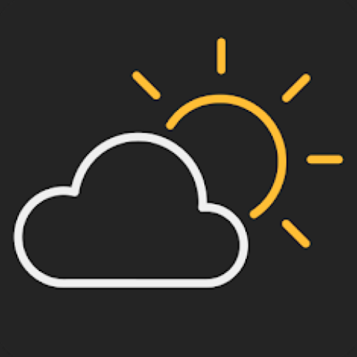

# Şehir Hava - README



WeatherApp is a weather application designed for Android devices, built to provide real-time weather information for various cities in Turkey. With its user-friendly interface and intuitive features, WeatherApp makes it convenient for users to stay updated with current weather conditions.

## Features

- **Weather Information by Province:** Select a province from the list of Turkish provinces, and WeatherApp will display the current weather information for the chosen city.

- **Daylight and Nighttime Themes:** The weather information page dynamically switches between daylight and nighttime themes, providing a pleasant visual experience based on the time of day.

- **Two Pages Navigation:** WeatherApp features two main pages. One page contains the list of provinces, and the other allows users to view detailed weather information.

- **Find My Location:** Easily find the city you are currently in by using the "Find My Location" button, which utilizes Google APIs to determine your current city.

## Technologies Used

- Written in Kotlin using Android Studio, WeatherApp takes advantage of the latest Android development capabilities.

- To enhance image loading and caching, the app integrates the [Picasso](https://square.github.io/picasso/) library.

- For efficient network operations and data retrieval, WeatherApp utilizes the [Volley](https://developer.android.com/training/volley) library.

## Installation

1. Clone the repository from GitHub to your local machine using the following command:

```bash
git clone https://github.com/ismet-koseoglu/SehirHava.git
```

2. Open the project in Android Studio.

3. Build and run the app on your Android device or emulator.

## Usage

1. Upon launching the app, you will land on the provinces list page.

2. Choose a province from the list to view the current weather information for the selected city.

3. If it is daytime, the weather information page will appear in a daylight theme. For nighttime, the page will adopt a nighttime theme.

4. To locate your current city, simply click the "Find My Location" button, which will identify your city using Google APIs.

## Contribution

WeatherApp is an open-source project, and contributions are welcome. If you have any suggestions, bug reports, or feature requests, feel free to raise an issue or submit a pull request.

Please follow the project's code of conduct and contribution guidelines while contributing.

## License

This project is licensed under the [MIT License](path/to/LICENSE).

---

Feel free to customize the content, add relevant links, and replace the placeholder images with actual screenshots and logo of your app. Additionally, don't forget to include the actual GitHub repository URL for users to access the code. Happy coding!
